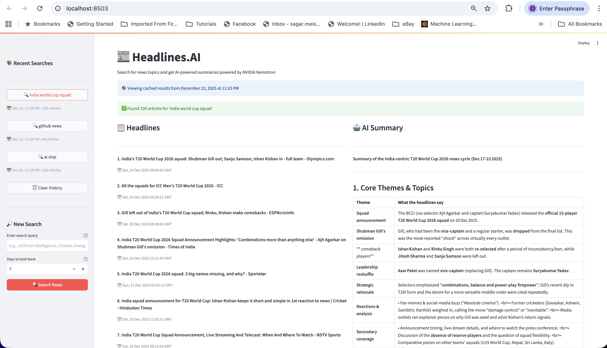

# Headlines.AI

> **Headlines are all you need**

**A zero cost Streamlit app showing how to offload expensive search API costs to free Google News RSS before switching to paid agentic search tools.**

**The Strategy:** Most paid agentic search APIs (Perplexity, Tavily, Exa) charge per query. But you can gather **initial context for free** by pulling 50-100 headlines from Google News RSS, then only use paid APIs when you need deeper analysis or verification.

This app demonstrates:
**Free tier (RSS)**: Gather headlines and surface-level signal at zero cost

By pulling headlines first, you can:
- Answer **80% of news queries for free** (headlines contain surprising signal)
- Build context cheaply before hitting paid APIs
- Reduce search API costs by 10-50x for common queries
- Learn agentic search patterns without burning through API budgets

**Perfect for:** Content creators, researchers, and developers who want to prototype AI search tools without racking up costs, or anyone learning how to build cost-efficient AI agents.

⚠️ **Not a replacement** for ChatGPT/Perplexity—they're better for casual use. This is a **learning template** showing you how to build similar tools while controlling costs.

## Screenshot



*Split-panel view: headlines on the left, AI-generated summary on the right*

## What This Project Teaches

- 🔍 **Agentic Search Patterns**: How to aggregate content from public sources and synthesize it with AI
- 🆓 **Free Tier Architecture**: Building useful tools using only free APIs (Google News RSS + OpenRouter)
- 📊 **Real-World Data Pipeline**: Fetching, parsing, caching, and presenting real-time data

## Who This Is For

- **Developers** learning to build AI agents and search tools
- **Students** exploring practical LLM applications
- **Builders** who want a template to fork and customize for specific use cases
- Anyone curious about **how agentic search works under the hood**

## Why Not Just Use ChatGPT/Gemini?

You should! For casual news searches, they're better—easier, more polished, with proper citations.

This project exists to:
- **Show you how it's built** (education > end product)
- Give you **full control** to customize/extend (add sentiment analysis, bias detection, custom workflows)
- Serve as a **base template** for domain-specific search tools
- Prove that **headlines contain surprising signal** for generating summaries

⚠️ **Disclaimer**: Google News may rate-limit with heavy usage. This is a learning project, not production infrastructure.

## Features

- 🔍 Search for news by any topic
- 📰 Fetch real-time headlines from Google News RSS
- 🤖 AI-powered summarization using NVIDIA Nemotron
- 📊 Split-panel view: headlines on the left, summary on the right
- ⚙️ Customizable search period (1-30 days)

## Setup

### 1. Install Dependencies

```bash
pip install -r requirements.txt
```

### 2. Configure Environment Variables

Create a `.env` file in the project root with your OpenRouter API key:

```env
OPENROUTER_API_KEY=your_api_key_here
```

You can get an API key from [OpenRouter](https://openrouter.ai/).

### 3. Run the Application

```bash
streamlit run app.py
```

The app will open in your default browser at `http://localhost:8501`.

## Usage

1. Enter a search query in the sidebar (e.g., "artificial intelligence", "climate change")
2. Set the number of days to look back (default: 7 days)
3. Click "🔍 Search News"
4. View the headlines in the left panel and AI summary in the right panel

## Project Structure

```
headlines.ai/
├── app.py                 # Main Streamlit application
├── google_news_rss.py     # Google News RSS fetching functionality
├── utils.py               # OpenRouter client and summarization
├── requirements.txt       # Python dependencies
├── .env                   # Environment variables (not in repo)
└── README.md             # This file
```

## Technologies

- **Streamlit**: Web application framework
- **Google News RSS**: News headline source
- **OpenRouter**: API gateway for LLM access
- **NVIDIA Nemotron**: AI model for summarization
- **feedparser**: RSS feed parsing
- **OpenAI Python SDK**: API client for OpenRouter

## Potential Extensions

Fork this and build something unique:

- 🎯 **Bias Detection**: Compare how different sources frame the same story
- 📈 **Trend Tracking**: Monitor topic evolution over days/weeks
- 🌍 **Multi-Language Support**: Aggregate news from different regions
- 📧 **Automated Briefings**: Schedule daily summaries via email
- 🔗 **Content Pipeline**: Feed summaries directly into your CMS
- 🤔 **Fact-Checking Layer**: Cross-reference claims across sources
- 🏷️ **Custom Categorization**: Train on domain-specific topics

## Notes

- The app uses the free tier of NVIDIA Nemotron via OpenRouter
- Headlines are fetched from Google News RSS feed
- Summarization includes reasoning capabilities enabled by default
- This is a **learning project**—for production, consider rate limits, error handling, and monitoring

